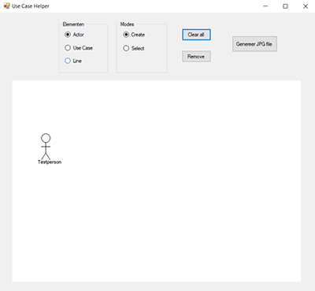
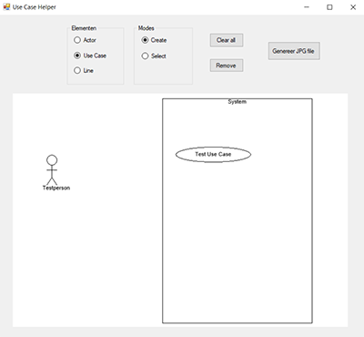
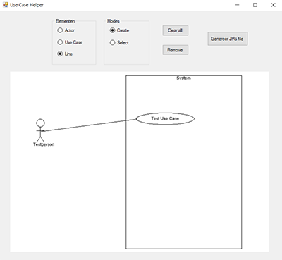

# Use Case Helper
## Description
This application is useful for creating Use Case diagrams.  
It provides you with tools to create actors, use cases (which also has automatic system creation) and lines.  
It's also possible to edit use cases and remove lines afterwards, making sure you won't have to start over from scratch when making a mistake.

## Screenshots
**Addition of actor**  
  

**Addition of use case**
  

**Addition of line**
  